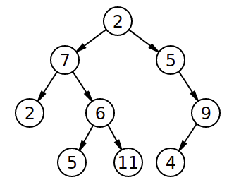

## How to solve this challenge?

1. Read the "Challenge description" below.
2. Make changes to the [challenge.js](./challenge.js) file.
3. Commit your changes.
4. Wait for the result of the "GitHub Classroom Workflow" action. If it is green - congratulations, you solved this challenge! If not - try again!
5. *You can watch an example of how to solve a challenge in the video linked in the theoretical lesson preceding this challenge.*


## Challenge description

### How Tall is the Tree?
_Can you find the height of a Binary Tree? The height is the number of Nodes from the Root to the lowest Leaf. The Tree does not need to be balanced._

For example, in the tree below, the height is 4:



### Challenge
Return the height of the Tree.

### Example
```ruby
const arrayTree = [2, 7, 5, 2, 6, 0, 9]

console.log(binaryTreeHeight(arrayTree))
=> 3
```

### Troubleshooting

If you cannot see any auto-grading workflows on the [Actions](../../actions) page, learn how to fix it in [this repo](https://github.com/microverse-students/autograding-troubles-js/blob/main/README.md).
