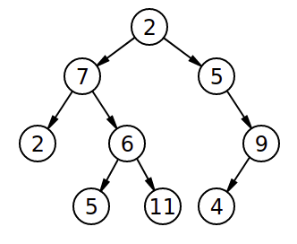

## How to solve this challenge?

1. Read the "Challenge description" below.
2. Make changes to the [challenge.rb](./challenge.rb) file.
3. Commit your changes.
4. Wait for the result of the "GitHub Classroom Workflow" action. If it is green - congratulations, you solved this challenge! If not - try again!
    - If you cannot see any auto-grading workflows on the  [Actions](../../actions) page, learn how to fix it in [this repo](https://github.com/microverse-students/autograding-troubles-ruby).
5. *You can watch an example of how to solve a challenge in the video linked in the theoretical lesson preceding this challenge.*


Note: We use RSpec for checking your solution with unit tests. You can [install](https://github.com/rspec/rspec) it and use it in your local environment if you like.

## Challenge description

### Is it balanced?
_Can you check if a tree is a height-balanced?_

In this challenge, a tree is height-balanced if the maximum and minimum path from any node to a terminal (null node) descendant differs by at most 1.

For example, this tree is not height-balanced, since the minimum path going down from 5 (to the left) is 2 less than the maximum path from 5 (to 9 and 4).



### Challenge
Return true if a given tree is height-balanced and false otherwise.

### Example
```ruby
tree = [1, 2, 0, 3, 4, 0, 0]

balanced_tree?(tree)
# => false
```
#### Get stuck and need some hint?
Check below link: 
https://gitlab.com/microverse/guides/coding_challenges/hints/blob/master/challenges/tress_and_graphs/is-it-balanced.md


### Troubleshooting

If you cannot see any auto-grading workflows on the [Actions](../../actions) page, learn how to fix it in [this repo](https://github.com/microverse-students/autograding-troubles-ruby).
